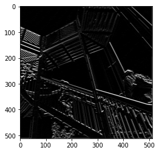
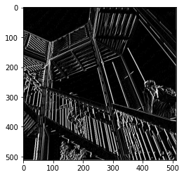
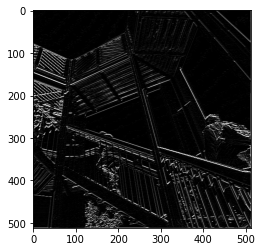
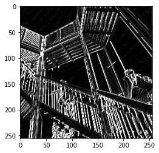

# Informal Response 3 
## 02/17/2021

### Last time you did an exercise (convolutions and pooling) where you manually applied a 3x3 array as a filter to an image of two people ascending an outdoor staircase. Modify the existing filter and if needed the associated weight in order to apply your new filters to the image 3 times. Plot each result, upload them to your response, and describe how each filter transformed the existing image as it convolved through the original array and reduced the object size. 

#### Picture 1

This filter darkens the image but keeps it relatively sharp

#### Picture 2

This filter accentuates the straight lines

#### Picture 3

This filter darkens and blurs the image

### What are you functionally accomplishing as you apply the filter to your original array (see the following snippet for reference)? Why is the application of a convolving filter to an image useful for computer vision? 

Applying a filter takes each set of 3x3 pixels and adds specific values to each one to transform the image. The benefit of a filter is that it accentuates the parts of the image that need to be identified. Some filters bring more attention to the vertical lines and others do the same for horizontal lines. Filters make the objects in the picture easier to identify. 

### Another useful method is pooling. Apply a 2x2 filter to one of your convolved images, and plot the result. In effect what have you accomplished by applying this filter? Does there seem to be a logic (i.e. maximizing, averaging or minimizing values?) associated with the pooling filter provided in the example exercise (convolutions & pooling)? Did the resulting image increase in size or decrease? Why would this method be useful?

Pooling reduced the size of the image, which is useful because smaller images are easier to work with and use in models. A 2x2 filter essentially takes each set of 2x2 pixels and assigns them all the same value. In this exercise, we used max pooling, which is why the largest value is applied to all of the pixels but using the minimum or the average is probably useful in different situations. 

The pooled image is brighter and more clear 

### Stretch Goal 

The resulting matrix is the following: 

[[0, 0, 0, 3, 0, 0, 0], 

 [0, 0, 0, 3, 0, 0, 0], 
 
 [1, 1, 1, 3, 1, 1, 1], 
 
 [1, 1, 1, 3, 1, 1, 1],
 
 [1, 1, 1, 3, 1, 1, 1],
 
 [0, 0, 0, 3, 0, 0, 0],
 
 [0, 0, 0, 3, 0, 0, 0]]
 
