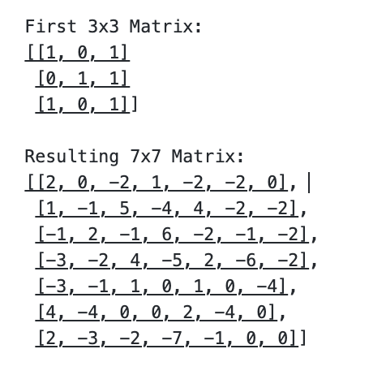

# Informal Reponse 4 

## 02/24/2021 

### Convolve the two 3x3 matrices that were assigned to you with your 9x9 matrix and calculate the resulting two matrices.

 
### What is the purpose of using a 3x3 filter to convolve across a 2D image matrix? 
The purpose of using a 3x3 filter to convolve across a 2D image is to emphasize certain parts of the image such as vertical or horizontal lines so that it can best be used as data in a model. It also makes the image smaller, which is helpful when it is being used in a model. It is essenitally a way of processing the data before it is used. 

### Why would we include more than one filter? How many filters did you assign as part of your architecture when training a model to learn images of numbers from the mnist dataset?
Using more than one filter may allow us to emphaizize multiple features in an image, which might therfore allow for creation of a more effective model. When I built my model on the mnist dataset, I only used one filter, but I may have had better results if I employed multiple. 
