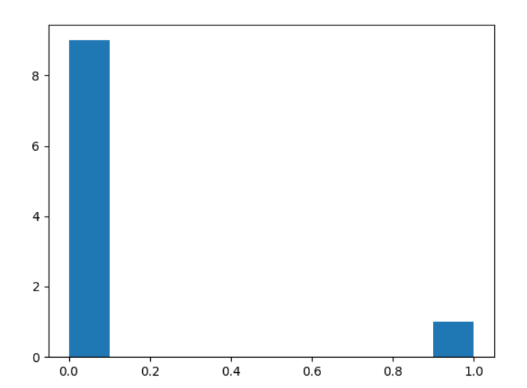

# Informal Response 2
## 02/08/2021

### Question 1: In the video, First steps in computer vision, Laurence Maroney introduces us to the Fashion MNIST data set and using it to train a neural network in order to teach a computer “how to see.” One of the first steps towards this goal is splitting the data into two groups, a set of training images and training labels and then also a set of test images and test labels. Why is this done? What is the purpose of splitting the data into a training set and a test set?

It is important to split the available data into training and testing data because testing on the same data that was used to train would not give an true representation of the actual accuracy of the model. This is because the model woud have already "seen" the data that it is being tested on during the training process. By setting some data aside, we are able to determine the "external validity" of the model, which is essenitally its accuracy when encountering new data that it has not been exposed to previously. This is important because in the future when a model is used in practice, it needs to be able to generalize to new data and it would be harmful if it were too overfitted to its training data. 

### Question 2: The fashion MNIST example has increased the number of layers in our neural network from 1 in the past example, now to 3. The last two are .Dense layers that have activation arguments using the relu and softmax functions. What is the purpose of each of these functions. Also, why are there 10 neurons in the third and last layer in the neural network.

The relu argument basically makes it so that if the output of a neuron is below 0, it sets that value to 0. This is because negative values can scew your model and therfore your results. The softmax attribute helps you find the most likely candidate. It essentially takes the soft probabilities and determines a hard classification by setting the option with the largest probability to 1 and the rest to 0. There are 10 neurons because there are 10 different classification options, and each neuron basically determines the probability that the image is that particular option. 

### Question 3: In the past example we used the optimizer and loss function, while in this one we are using the function adam in the optimizer argument and sparse_categorical- crossentropy for the loss argument. How do the optimizer and loss functions operate to produce model parameters (estimates) within the model.compile() function?

In order to make predictions, the optimizer and loss functions work together within the model.compile() function. Essentially, the model makes a prediction, and then the loss function determines how good or bad that particular prediction is. From there, the optimizer makes tweaks, which slowly accumulate to make more accurate preductions. The loss function basically determines the quality of the prediciton, while the optimizer keeps trying to better it. 

### Question 4: Using the mnist drawings dataset (the dataset with the hand written numbers with corresponding labels) answer the following questions. What is the shape of the images training set (how many and the dimension of each)? What is the length of the labels training set? What is the shape of the images test set?Estimate a probability model and apply it to the test set in order to produce the array of probabilities that a randomly selected image is each of the possible numeric outcomes (look towards the end of the basic image classification exercises for how to do this — you can apply the same method applied to the Fashion MNIST dataset but now apply it to the hand written letters MNIST dataset).

There are 60,000 images in the training set, and they are each 28 by 28 pixels. The labels training set also has 60,000 values with one label corresponding to each image. The image test set contains 10,000 images that are each 28 by 28 pixels. I chose the 123rd image in the test set, and used the model to predict its value. 

### Question 5: Use np.argmax() with your predictions object to return the numeral with the highest probability from the test labels dataset.

My model predicted that the numeral with the highest probability was the number 6. 

### Question 6: Produce a plot of your selected image and the accompanying histogram that illustrates the probability of that image being the selected number

