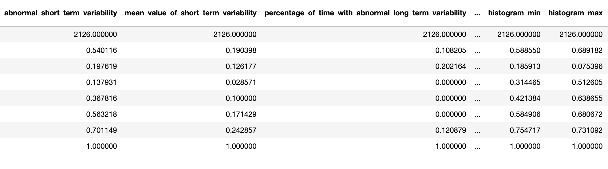
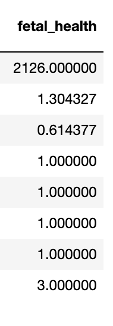

# Final Project 

## 05/03/2021 

### Problem Statement that introduces your selected topic, identifies significant goals associated with the implementation of your applied machine learning method, demonstrates why your problem is important, and describes and analyzes the complex nature of your problem including any process oriented causes and effects. Conclude your problem statement with a stated central research question. You are welcome to articulate a central research question in broad and general terms, given the abbreviated time frame for this investigation. 

Fetal mortality is a serious concern in countries throughout the world. In the United States, 1 in 160 deliveries still results in stillbirth. In 2019, the global neonatal mortality rate was 19 deaths per 10000 live births. In 2015, about 2.7 million children died in their first month of life. Location also plays a key role in these trends, and neonatal mortality is highest in central and southern Asia as well as in sub-Saharan Africa. In these areas, the rate is 29 deaths per 1,000 live births. 

It is a goal of nations and health care providers globally to reduce fetal mortality rates and increase fetal health as a whole. In fact, Unicef lists one of their Sustainable Development Goals (SDGs) as aiming to end/reduce preventable deaths of newborns and children under 5 years of age within the next decade. In order to take that step, it is crucial to be able to measure and predict the health of a fetus. One way to measure fetal health is by using a machine known as a Cardiotocogram (CTG). These are not too complex and are a cheap and accessible way to measure fetal health. CTGs function by sending ultrasound pulses and reading the responses. This allows for the collection of fetal heart rate (FHR), fetal movements, uterine contractions, etc. Through this project, I am aiming to discover if a machine learning model can be used to predict fetal health based on these measurements from a CTG. This leads to my central research question: How well can machine learning models be used to predict fetal health based specifically on measurements from cardiotocograms?

### A description of the data that you are using as input for your applied machine learning methodology, including the source of the data, the different features (variables) and well as their data class (i.e. continuous or discrete). Be sure to include a description of your dataset size (number of rows / observations as well as number of columns / variables / features) and provide context on how the data was collected as well as the source organization, as it is relevant to your investigation. 

In this project, I used a dataset from Kaggle that had 2126 records of measurements from Cardiotocograms. After these measurements were collected through CTGs, they were then classified by OBGYNS into 3 categories: Normal, Suspect, and Pathological. The dataset includes 21 features that are all continuous variables. The features are 'baseline value', 'accelerations', 'fetal_movement', 'uterine_contractions', 'light_decelerations', 'severe_decelerations', 'prolongued_decelerations', 'abnormal_short_term_variability', 'mean_value_of_short_term_variability', 'percentage_of_time_with_abnormal_long_term_variability', 'mean_value_of_long_term_variability', 'histogram_width', 'histogram_min', 'histogram_max', 'histogram_number_of_peaks', 'histogram_number_of_zeroes', 'histogram_mode', 'histogram_mean', 'histogram_median', 'histogram_variance', and 'histogram_tendency'. The 22nd column, the target column, is called 'fetal_health' and includes a classification of 1, 2, or 3 corresponding to Normal, Suspect, and Pathological respectively. Here is a detailed summary of the dataset. 

#### Features 

#### Target 

 
### Provide the specification for your applied machine learning method that presented the most promise in providing a solution to your problem. Include the section from your python or R script that specifies your model architecture, layers, functional arguments and specifications for compiling and fitting. Provide a brief description of how you implemented your code in practice. 

The most successful model that I built was a Logistic Regression Classification Model with Keras. The neural network that I built consisted of an input layer, hidden layers, and then an output layer. The input layer is where the measurements and observations are fed to the model, the hidden layers are wehrer the neural network makes connections between the data and learns about the data, and the output layer is where the final output is discovered. 

Before I built the actual model, I had to do some data preprocessing. The data that was given to me was pretty clean overall, but I did manipulate it a bit to make it easiest to work with. I split the dataframe into 2 sections: 1 with all the feature columns and the other with the target column. I next used train_test_split() to split the data into training and testing subsets. 

Below I have included the code that I used to build the model with its layers as well as compile/fit the model. After this step, I predicted the internal and external accuracies of the model. 

### Conclude with a section that preliminarily assesses model performance. If you have results from your implementation, you are welcome to add those in this section. Compare your preliminary results with those from the literature on your topic for a comparative assessment. If you are not able to produce preliminary results, provide a cursory literature review that includes 2 sources that present and describes their validation. With more time and project support, estimate what an ideal outcome looks like in terms of model validation.

The accuracy of my model was about 87% on the training dataset and 76% on the testing dataset. This is honestly much higher than I was expecting considering the length of this project, but I was pleasantly surprised! I think that this may have been due to the extremely clean dataset that I was able to find that made it easier to create a pretty solid model. However, in an article that I found from the NCBI that was classifying fetal health similarly, the researchers were able to achieve over 95% accuracy in their best models. I think this shows that that may be a threshold that I could reach if I dug a little deeper and had some more time to work on this project. In another article that I found, researchers build random forest models and achieved a 94.69% accuracy. It seems that 95% is the general threshold to achieve in order for a model to be considered successful in research such as this that deals with medical data. 

### Works Cited 
https://www.pluralsight.com/guides/classification-keras

https://www.ncbi.nlm.nih.gov/pmc/articles/PMC6822315/

https://link.springer.com/chapter/10.1007/978-3-319-07773-4_19

