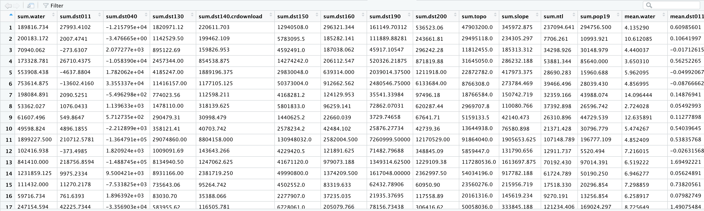
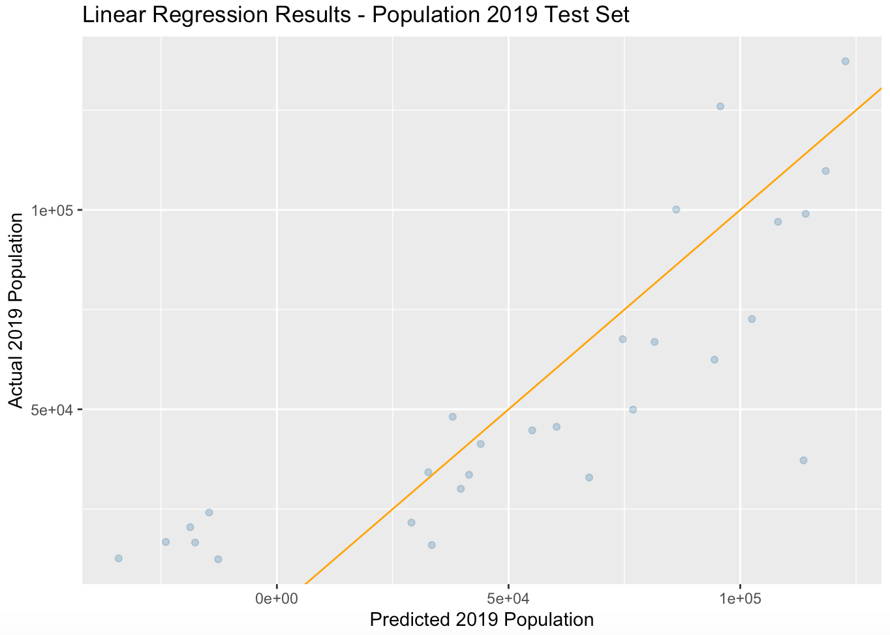
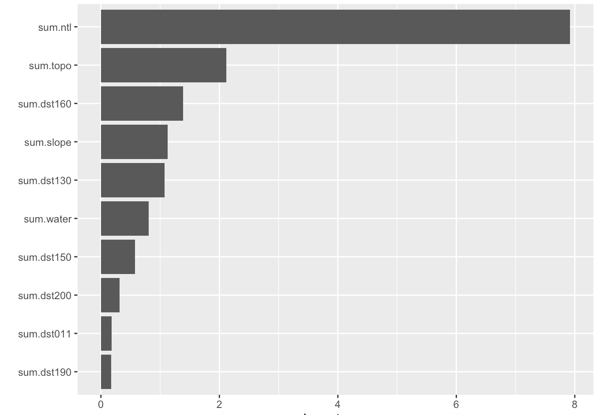

# Informal Response 6

## 03/22/2021

### The country I chose is Costa Rica, and I was able to create the raster stack and calculate the summary statistics shown below.

###  R^2 plot and  importance of each variable shown below

