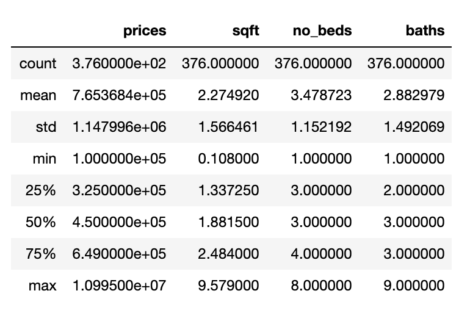

# Project 1 

## 03/01/2021 

### A description of the housing data you scraped from zillow
I initially had 400 data points, but had to remove some due to incomplete or unusable date. Ultimately, I ended up with 376 data points corresponding to different homes in Austin, Texas. Each data point had information about its price, address, number of beds, number of baths, and its squarefootage. These data points were loaded into a csv file and then used to create a pandas dataframe. Here are some descriptive statistics about the collected data: 

### A description of your model architecture
Before building the model, I preprocessed the data into a form usable for the model. This included dropping a couple of bad data points as well as dividing all the values for squarefoot by 1000. Next, I created numpy arrays named x1, x2, and x3 that corresponded to each of the 3 features number of beds, squarefootage, and number of baths respectively. I next stacked them together into a variable called xs and made a variable called ys that included all the corresponding prices for the houses. I imported Tesorflow in order to help build the model. Next, I initialized the keras Sequential model with an input shape of 3. I then compiled the model with a stochastic gradient descent optimizer and mean squared error as the loss function. Finally, I fit the model based on the values in my xs and ys variables with 500 epochs. 

At this point, my model had been created, and it was time to start pretictions. I used the same data points that were utilized to train the model to test it, and added the predicitons in another column to the original dataframe. Next, I created one more column called difference that held the value of predicted price minus the true price. 

### An analysis of your model output
The model that I built was not super accurate for the most part, which I think is somewhat expected with only 3 features being used in predictions. The MSE values that I calculated tended to be pretty high. The 10 biggest over-predictions
had an MSE of 535562223415.2863, and the 10 biggest under-predictions had a value of 23479729427135.414. Even the 10 most accurate results still had a pretty large MSE of 69908328585.21533. 

### An analysis of the output that assesses and ranks all homes from best to worst deal

