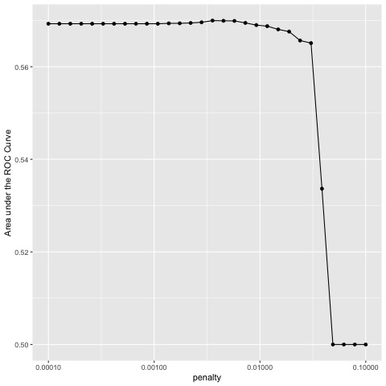
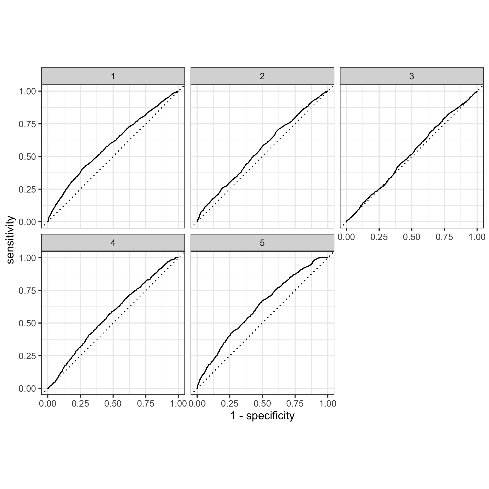
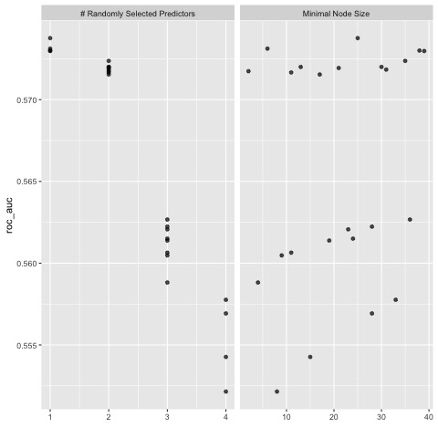
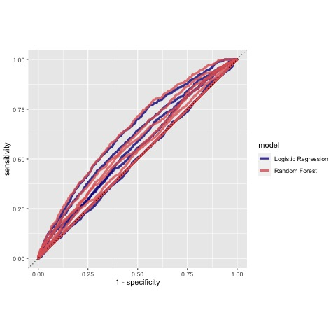
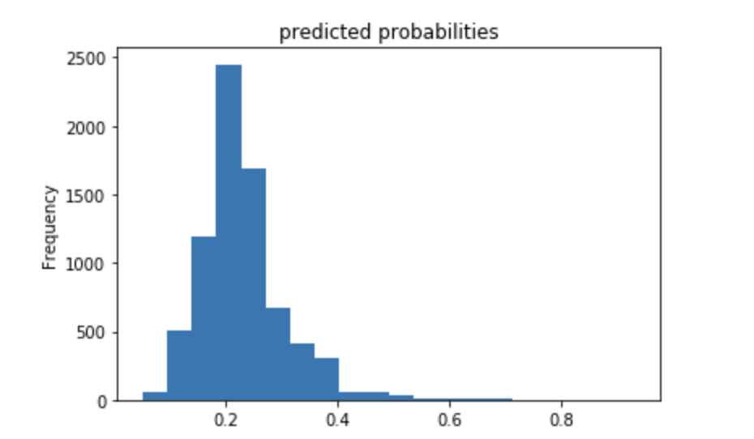
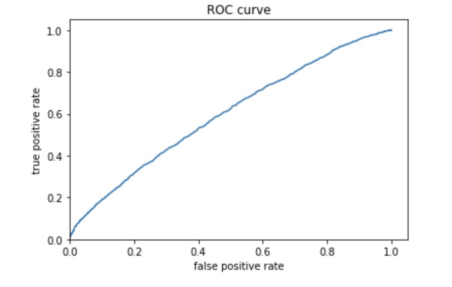
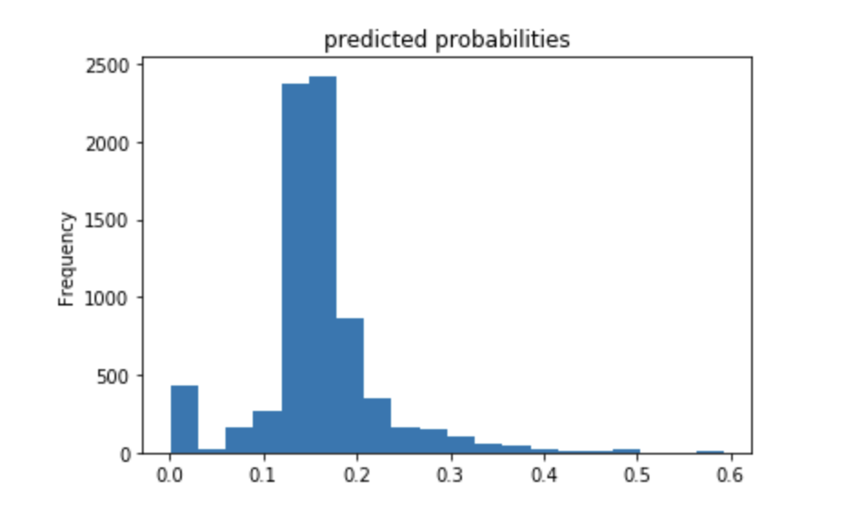
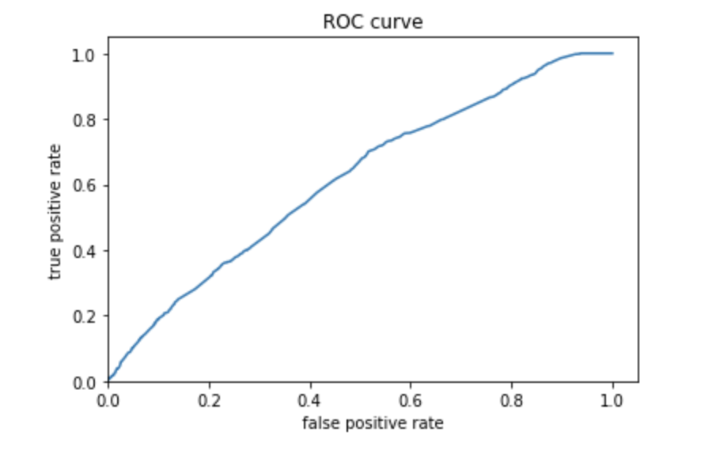

# Project 2 

## 03/19/2021

### Using the R script provided, split and sample your DHS persons data and evaluate the AUC - ROC values you produce. 

### Which "top_model" performed the best (had the largest AUC)? 

As you can see from the plot above, points 1 to 20 all have similarly high values for the AUC with point 16 having the highest value of about .57. I chose to use 

### Are you able to use the feature selection penalty to tune your hyperparameter and remove any potentially irrelevant predictors? Provide justification for your selected penalty value? 

I chose the penalty value from the 16th point because it has the highest AUC as well as a relatively high penalty compared to the other points that have similar AUC values. In reality though, most of the first 20 points could be used without too much impact because they are all fairly similar. 

### Finally, provide your ROC plots and interpret them. How effective is your penalized logistic regression model at predicting each of the five wealth outcomes.

By observing the graph above, it can be determined that the model is most effective for categories 1 and 5. It is decent for 4, okay for 2, and pretty bad for 3. This shows that more work could definitely be done in improving the model for the middle wealth incomes in comparison to the extremes.

### Using the R script provided, set up your random forest model and produce the AUC - ROC values for the randomly selected predictors, and the minimal node size, again with wealth as the target. 

Shown above is a plot of the minimal node size as well as randomly selected predictors. 

### Provide your ROC plots and interpret them. 

### How did your random forest model fare when compared to the penalized logistic regression? 

The random forest models were pretty similar to the logistic regression models themselves. The same trends also hold betweeen the two types of models witht the 1st and 5th categories being the most accurate and categories 2-4 being the least. 

### Are you able to provide a plot that supports the relative importance of each feature's contribution towards the predictive power of your random forest ensemble model?

### Using the python script provided, train a logistic regression model using the tensorflow estimator API and your DHS data, again with wealth as the target. Apply the linear classifier to the feature columns and determine the accuracy, AUC and other evaluative metrics towards each of the different wealth outcomes. 

still figuring out...

### Then continue with your linear classifier adding the derived feature columns you have selected in order to extend capturing combinations of correlations (instead of learning on single model weights for each outcome). Again produce your ROC curves and interpret the results.

### Using the python script provided, train a gradient boosting model using decision trees with the tensorflow estimator. Provide evaluative metrics including a measure of accuracy and AUC. Produce the predicted probabilities plot as well as the ROC curve for each wealth outcome and interpret these results.

still figuring out... 

### Analyze all four models. According to the evaluation metrics, which model produced the best results? Were there any discrepancies among the five wealth outcomes from your DHS survey dataset?

