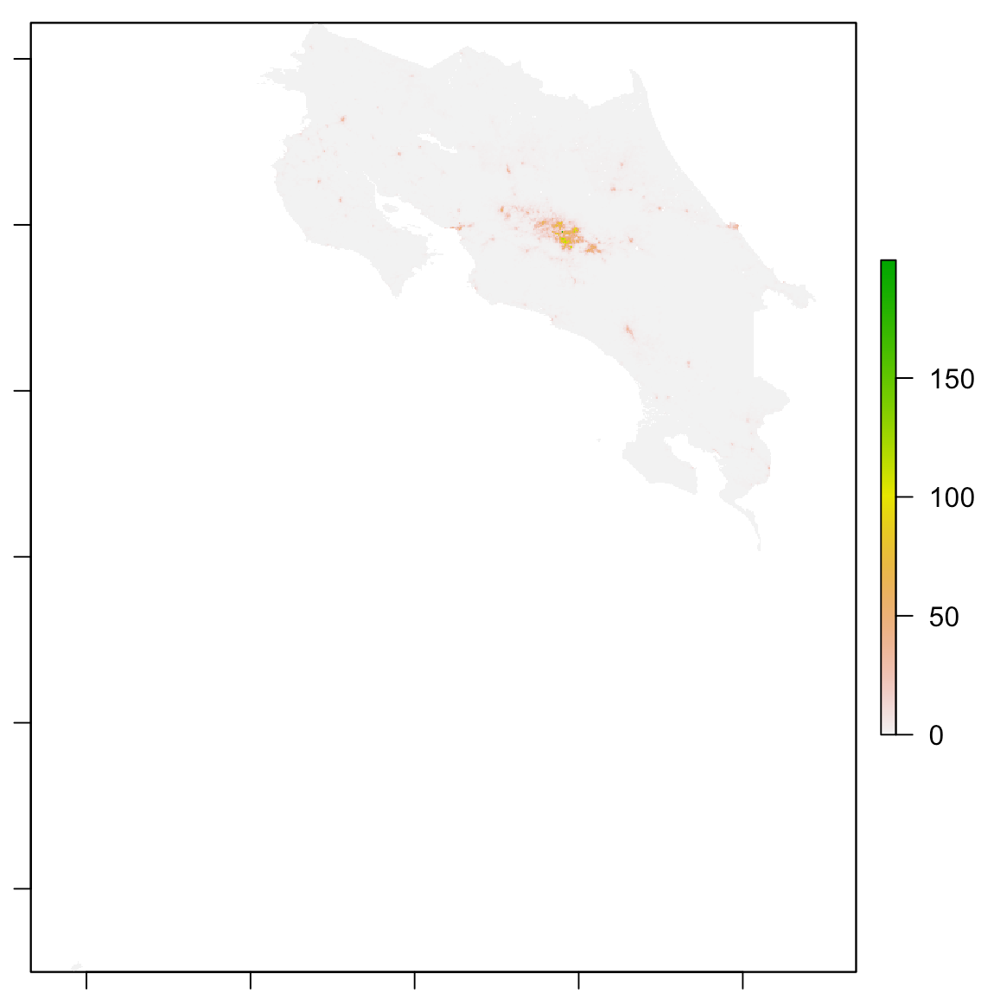
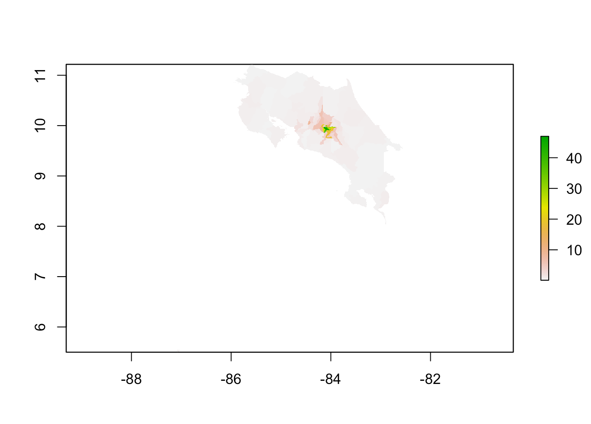
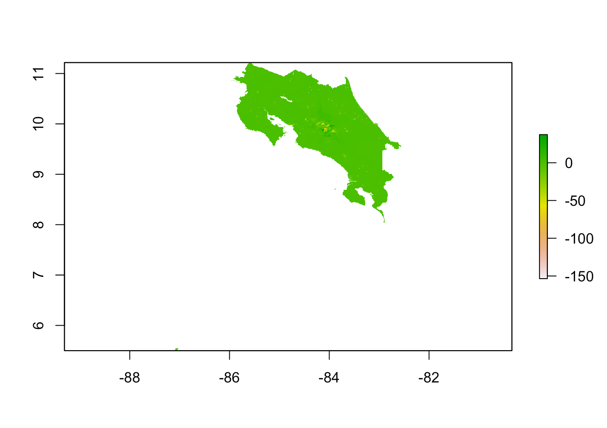
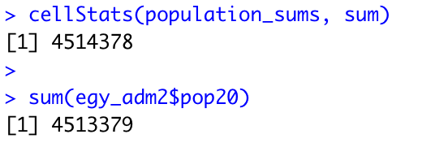
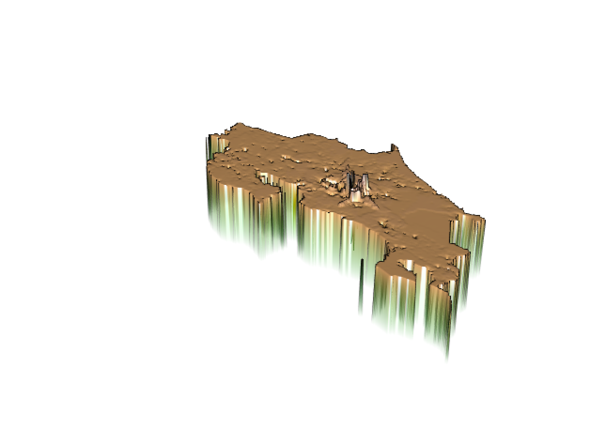
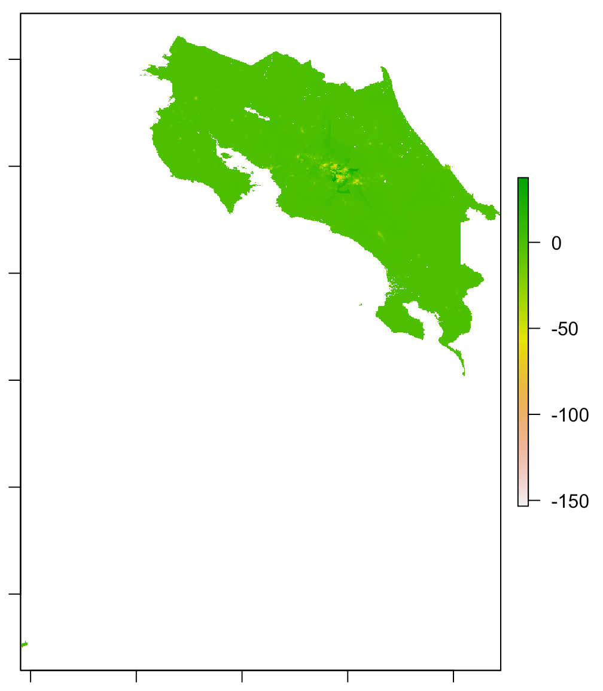
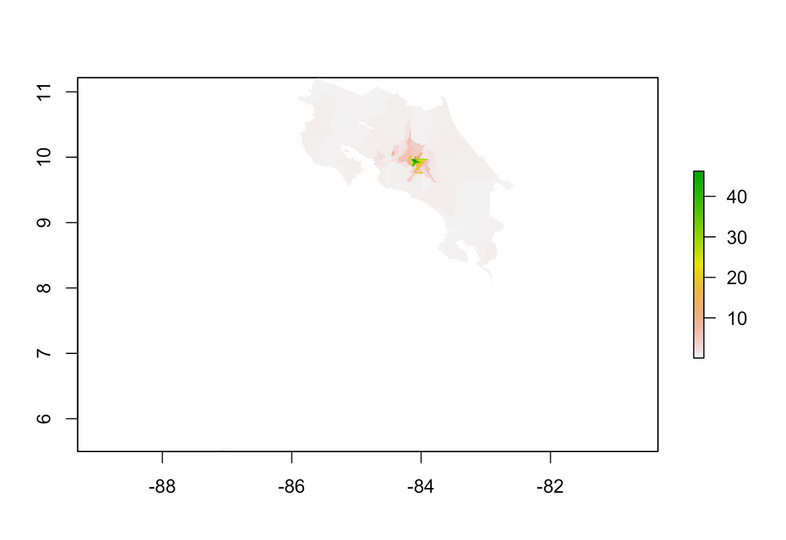
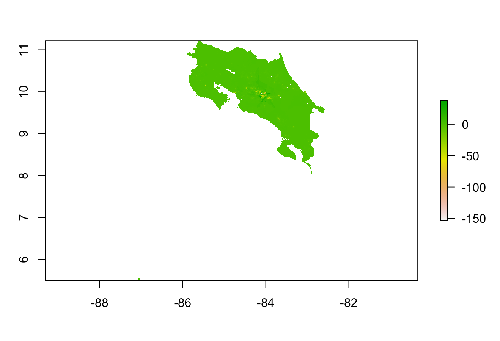

# Project 3
## 04/16/2021
### Using two machine learning methods predict population values at 100 x 100 meter resolution throughout your selected country. Validate the two models using different methods presented in this class. Write a report assessing the two approaches and which of the two models was more accurate. Be sure to account for spatial variation throughout your selected location and provide substantive explanations for why those variations occurred. 

For this project, I used data from worldpop to create a linear regression and random forest model to predict populaiton counts throughout the country. First, many packages were installed and imported such as raster, tidymodels, and sf. Next, I brought in the data and created a raster stack and did some cleaning of the data. Then the data was split and some was reserved for testing and the rest was reserved for training the linear regression model. Once the recipe and workflow were set up, the raster stack was converted to a dataframe, and the prediction step occured, and then it was convefrted back to raster form where more calculations occurred. The process is very similar for the random forest model. 

Here is a graph of the actual population distribution of Costa Rica. When comparing it to the other graphs in this report, be mindful of the fact that its scale is different than other similar graphs. 

### Linear Regression Model

The plot above shows population distribution based on predicted values from the linear regression model. You can see that there is a high predicted population concentration at the center of the country. This is shown by the green region in the center, and the color faded to pink and then white as the distance gets closer to the coast. 

The validation method that I used to determine the relative accuracy of the models was diff_sums, which is the difference between the predicted population sum and the actual population sum. The graph above show the diff_sums values throughout the country for the linear regression model. The variable population_sums contains the predicted value, and the variable cri_pop15 contains the actual value. In addition to the graph, if you look at the min and max values for the linear regression model, you can see that the diff_sums values tend to be negative. This means that the actual values must be larger than the predicted values, which means that the model tends to underpredict. 

By interpeting the graphs above, one can also see that the model tends to underpredict most in urban areas and cities as opposed to the more rural areas. 

The graphs above show the diff_sums values throughout the country for the linear regression and random forest models respectively. The graphs look pretty similar, which shows that they have similar accuracy levels. It looks like the linear regression model had more areas of green, and the random forest had more white, pink, and yellow regions. The more negative the value, the more the model underpredicted in that region, and the closer to 0, the more accurate the model is at predicting for that region. 

### Random Forest Model

The plot above shows population distribution based on predicted values from the ransom forest model. This can be compared to the graph for diff_sums shown below

The validation method that I used to determine the relative accuracy of the models was again diff_sums, which is the difference between the predicted population sum and the actual population sum. The graph above show the diff_sums values throughout the country for the random forest  model. In addition to the graph, if you look at the min and max values for the model, you can see that the diff_sums values tend to be negative. This means that the actual values must be larger than the predicted values, which means that the model tends to underpredict just like the linear regression model. 

