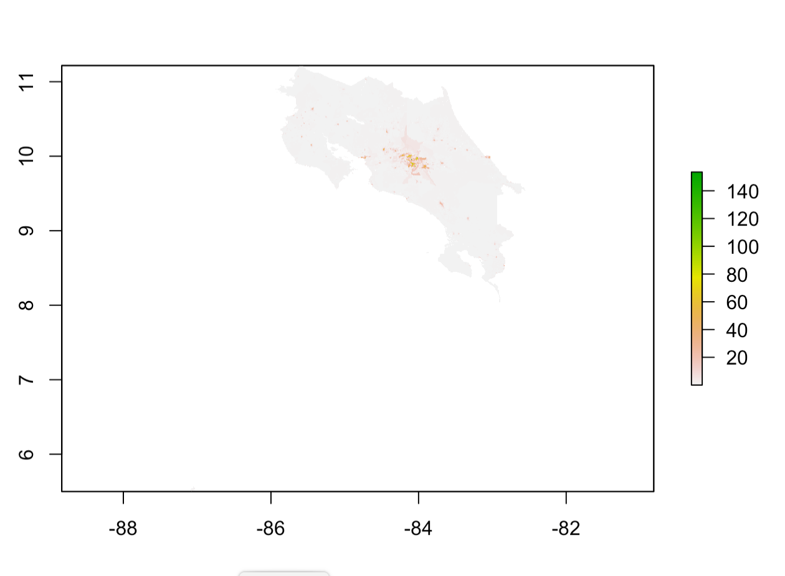
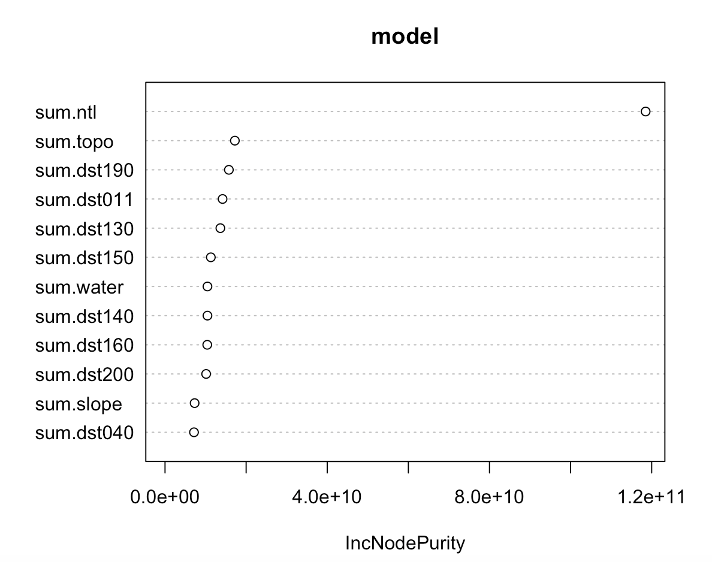
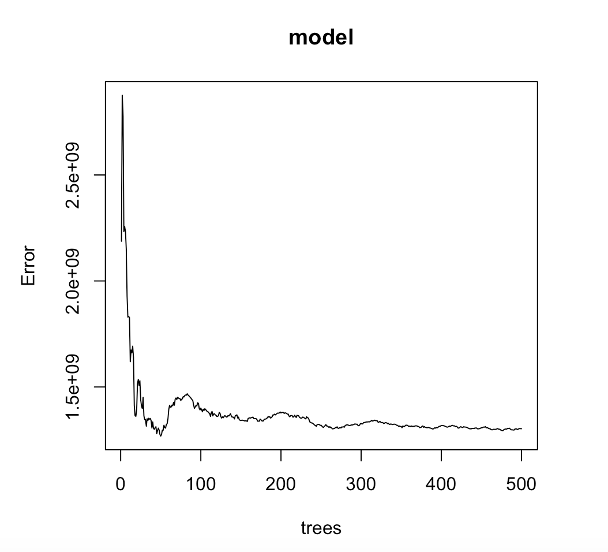
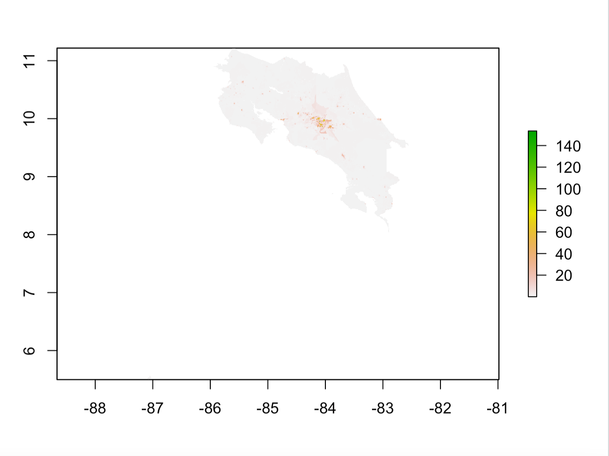
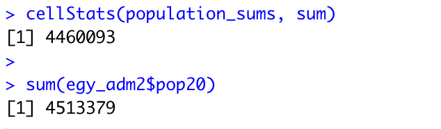
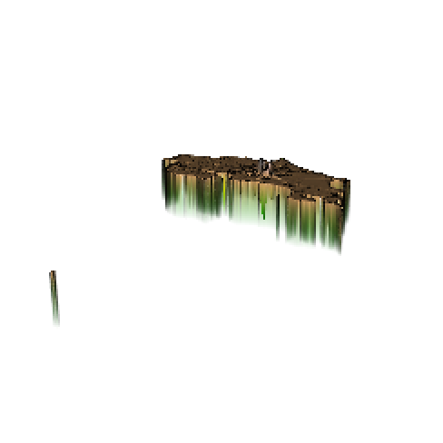

# Project 3
## 04/16/2021
### Using two machine learning methods predict population values at 100 x 100 meter resolution throughout your selected country. Validate the two models using different methods presented in this class. Write a report assessing the two approaches and which of the two models was more accurate. Be sure to account for spatial variation throughout your selected location and provide substantive explanations for why those variations occurred. 

For this project, I used data from worldpop to create a linear regression and random forest model to predict populaiton counts throughout the country. First, many packages were installed and imported such as raster, tidymodels, and sf. Next, I brought in the data and created a raster stack and did some cleaning of the data. Then the data was split and some was reserved for testing and the rest was reserved for training the linear regression model. Once the recipe and workflow were set up, the raster stack was converted to a dataframe, and the prediction step occured, and then it was convefrted back to raster form where more calculations occurred. The process is very similar for the random forest model. 

Here is a graph of the actual population distribution of Costa Rica. When comparing it to the other graphs in this report, be mindful of the fact that its scale is different than other similar graphs. 

### Linear Regression Model

The plot above shows population distribution based on predicted values from the linear regression model. You can see that there is a high predicted population concentration at the center of the country. This is shown by the green region in the center, and the color faded to pink and then white as the distance gets closer to the coast. 

One validation method that I used to determine the relative accuracy of the models was diff_sums, which is the difference between the predicted population sum and the actual population sum. The graph above show the diff_sums values throughout the country for the linear regression model. The variable population_sums contains the predicted value, and the variable cri_pop15 contains the actual value. In addition to the graph, looking at the min and max values for the linear regression model, you can see that the diff_sums values tend are sometimes negative and sometimes positive. If they are negative, the model tends to underpredict, and if they are positive the model tends to overpredict. The other validation method that I used was MSE, and this model had an MSE of 68160.89. The MSE plot is shown below. 

By interpeting the graphs above, one can also see that the model tends to underpredict most in urban areas and cities and overpredicted in the more rural areas. 

### Random Forest Model

Here is the relevance of each factor in the model:

Here is the error in the model: 

The plot above shows population distribution based on predicted values from the ransom forest model. This can be compared to the graph for diff_sums shown below

One validation method that I used to determine the relative accuracy of the models was again diff_sums, which is the difference between the predicted population sum and the actual population sum. The graph above show the diff_sums values throughout the country for the random forest  model. In addition to the graph, if you look at the min and max values for the model, you can see that the diff_sums values tend to be negative. This means that the actual values must be larger than the predicted values, which means that the model tends to underpredict just like the linear regression model. Another validation method that I used was MSE, and the plot is shown below. 

Again, it appears that the model underpredicted more in areas that were more urban.

### Comparing the 2 models 

The graphs of the diff_sums for the two models look pretty similar, which shows that they have similar accuracy levels. The actual population was 4513379, and the linear regression model predicted it to be 4514378 while the random forest predicted it to be 4460093. This shows that the linear regression model was more accurate and predicted a value closer to the actual value, while the random forest model underpredicted a bit too much. In addition, in order to compare the two models, I calculated an MSE value for each one. The MSE value for the linear regression model was 68160.89, which was less than the MSE for the random forest model. Since we are trying to minimize the error, once again the linear regression model performed better. 

In addition, there was spatial variation in the results. The urban centers were far more likely to be underpredicted. This might have something to do with the fact that night time lights was largely valued in the prediction model. While there are more lights in cities, the exact increase in lights is unlikely to be quite proportional to the drastic increase in population that occurs in cities. It makes sense that it is hard for the model to realize how many more poeple are living in that small area compared to the large regions of lower population. 

